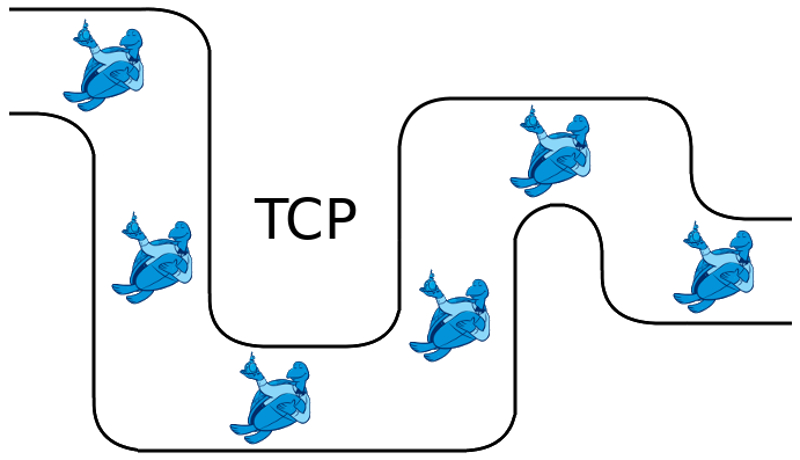

<p align="center">
    
</p>

---

# ros2_tcp_tunnel
Nodes that allow reliable TCP relay of ROS 2 topics between remote machines.

## Basic Usage
On the publishing machine, run the server node using the following command:
```bash
ros2 run tcp_tunnel server
```

On the subscribing machine, run the client node using the following command:
```bash
ros2 run tcp_tunnel client --ros-args -p client_ip:="<client ip address>"
```

Once both nodes are running, topics can be added to the TCP tunnel dynamically using the following service call:
```bash
ros2 service call /tcp_tunnel_client/add_topic tcp_tunnel/srv/AddTopic "topic:
  data: '<topic name>'
tunnel_queue_size:
  data: '<tunnel queue size>'
server_namespace:
  data: '<server namespace>'"
```
The `tunnel_queue_size` field can be left empty to use the default value of 2.
If the server node is located in the global namespace (default), the `server_namespace` field can be left empty or can be set to '/'.
This will create a new topic named `/tcp_tunnel_client/<topic name>` published on the subscribing machine in which the messages of the original topic are relayed.

Topics can be removed from the TCP tunnel at any time using the following service call:
```bash
ros2 service call /tcp_tunnel_client/remove_topic tcp_tunnel/srv/RemoveTopic "topic:
  data: '<topic name>'"
```
The provided topic name must be the name of the topic at the exit of the TCP tunnel.

## Advanced Usage
### Tuning the tunnel queue size
The TCP tunnel uses a message acknowledgement mechanism between the server and client nodes.
The tunnel queue size parameter controls how many messages can be sent simultaneously through the TCP tunnel.
When the tunnel queue is full, the server drops messages received on the original topic until an acknowledgement is received from the client, after which the next message received on the original topic will be sent through the tunnel.
If messages are published on the original topic at a higher rate than what can pass through the tunnel, this mechanism will ensure that the tunnel latency does not grow indefinitely.
The tunnel queue size should be increased by the user until the publishing rate of the relayed topic reaches a plateau.
Be careful not to overshoot the queue size however, because a tunnel queue size that is too high can increase the latency of the TCP tunnel.

### Providing a list of topics on startup of the client node
It is possible to provide a YAML file listing all the topics to add to the TCP tunnel when starting the client node.
For instance, if the user wanted to add the topics `/foo` and `/bar` automatically on startup of the client node, a YAML file with the following content should be created:
```yaml
- topic: /foo
  tunnel_queue_size: 2
  server_namespace: /

- topic: /bar
  tunnel_queue_size: 2
  server_namespace: /
```
The `tunnel_queue_size` field can be left blank to use the default value of 2.
If a server node is located in the global namespace (default), its `server_namespace` field can be left blank or can be set to '/'.
This topic list can then be passed to the client node on startup using the following command:
```bash
ros2 run tcp_tunnel client --ros-args -p client_ip:="<client ip address>" -p initial_topic_list_file_name:="<yaml file name>"
```

### Running multiple client nodes simultaneously
In order to run multiple client nodes simultaneously, each client node must be located in its own namespace.
This can be achieved by running the client nodes with the following command:
```bash
ros2 run tcp_tunnel client --ros-args -p client_ip:="<client ip address>" -r __ns:="<client namespace>"
```
Make sure to provide a namespace starting with '/'.
It is then possible to call the client nodes `add_topic` services in their respective namespace:
```bash
ros2 service call <client namespace>/tcp_tunnel_client/add_topic tcp_tunnel/srv/AddTopic "topic:
  data: '<topic name>'
tunnel_queue_size:
  data: '<tunnel queue size>'
server_namespace:
  data: '<server namespace>'"
```

### Running multiple server nodes simultaneously
Similarly, to run multiple server nodes simultaneously, each server node must be located in its own namespace.
This can be achieved by running the server nodes with the following command:
```bash
ros2 run tcp_tunnel server --ros-args -r __ns:="<server namespace>"
```
Make sure to provide a namespace starting with '/'.
Then, when adding a topic to the TCP tunnel, the proper server namespace must be passed in the service call:
```bash
ros2 service call /tcp_tunnel_client/add_topic tcp_tunnel/srv/AddTopic "topic:
  data: '<topic name>'
tunnel_queue_size:
  data: '<tunnel queue size>'
server_namespace:
  data: '<server namespace>'"
```
